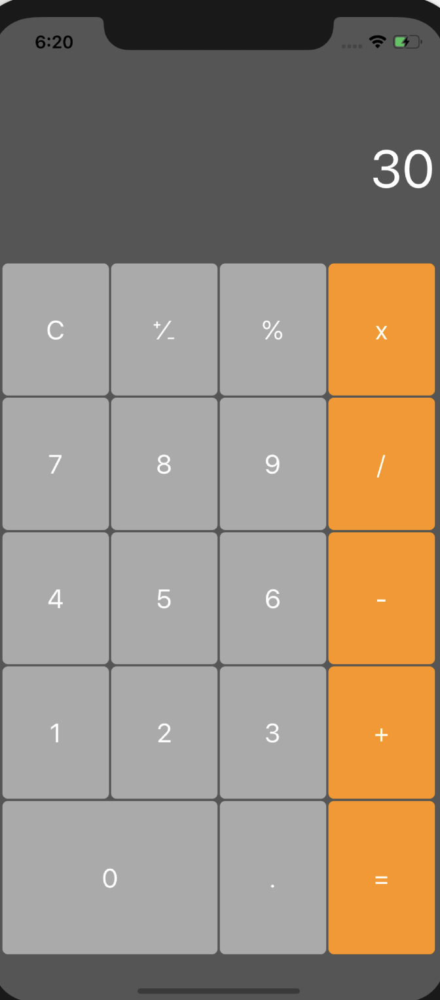
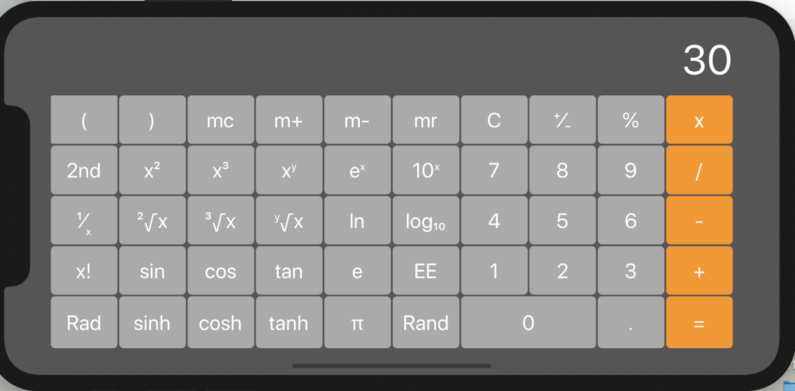

# iOS-hw1-Calculator

> 191220116 王璇


## 项目内容

仿照Apple官方iOS中的计算器编写一个自己的计算器App，要求（利用Autolayout技术）支持竖屏（portrait）和横屏（landscape）两种使用模型


## 实现结果

> 在Xcode11.3.1下完成，使用iPhone 11 Pro Max下演示



具体请见视频内容


## 实现过程

### 计算器基本功能

基本功能实现利用如下函数，将符号与具体操作联系起来，将操作的`button`的内容传给`calculator`，`performOperation`函数对其进行具体的运算存储操作，结果返回给`controller`;`controller`将操作符的行为用字典存储起来，使用起来非常方便。

对于某些键的变化，只要设置一些标志，利用标志的情况进行相应运算或者更改内容，如`Rad`和`Deg`的变化

```
if op == "Deg"{
    sender.setTitle("Rad", for: .normal)
}
else if op == "Rad"{
    sender.setTitle("Deg", for: .normal)
}
```

### 竖屏横屏

利用文档操作即可

###乱按

对于一些不在计算器运算函数定义域里的乱按键的情况，我采取的是手动进行约束，得到的结果置为`Double.nan`，在label即在屏幕中显示为`nan`，不知道有没有更容易的方法

### 问题

1 在实现mc等相关键的功能时，定义的`memory`变量放在类里就会报错，说是有类型问题，猜测是因为将`operations`定义与`memory`放在一起，而`operations`修改了它的值。

2 数字精度问题，因为`pi`的精度问题，可能就没有办法让例如`sin30=0.5`，所以不能完全按照实践视频里那样，可以采取如下方式

```
case .UnaryOp(let function):
     res = function(operand)
     return (res! * 10000000).rounded() / 10000000
}
```


## 感想体会

实践视频给出了大体框架，减轻了很多任务量，问题一步步来，就没有想的那么复杂了，例如，在实现"2nd"的功能时，其实只需要更换相应键的内容即可，相应键的功能还是与内容相一致的，实现起来是比较容易的。虽然自己实现的计算器看上去没有实际的计算器那么完美，但是我在这个过程中收获了乐趣，也更能体会到上课学习到的内容。对于文档的阅读，自己还是需要再多点耐心，很多时候太过着急很想知道一个结果，可能会遗漏很多重要信息。
